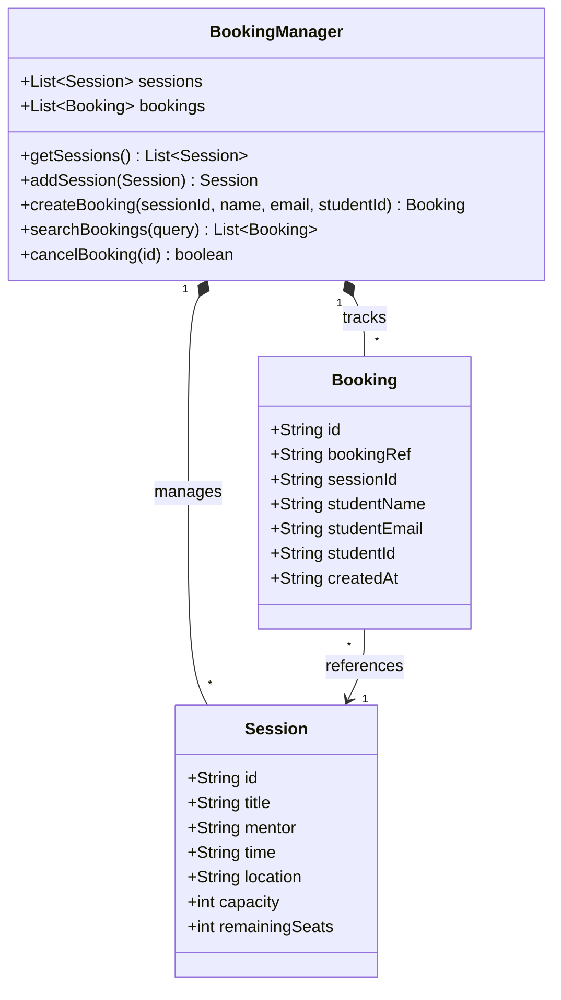

# UDST Skills Day Booking System 🎓

A full-stack Next.js application designed and built for the University of Doha for Science and Technology (UDST) Skills Day. The platform allows students to interactively view up-to-date workshop sessions, book their secure spots, review their itineraries, and provides an admin dashboard for session management.

## 🚀 Tech Stack
- **Framework**: Next.js 14 (App Router)
- **Language**: TypeScript
- **Styling**: Tailwind CSS (Custom UDST Brand Tokens)
- **Animations**: Framer Motion
- **Architecture**: Separated UI Components & RESTful API Routes
- **Database**: Thread-safe Global In-memory Store (Mocked for Hackathon)

## ✨ Completed Features (Epics)
- ✅ **Epic 1: Project Setup** - Next.js foundation, Navy/Gold UDST Theme, Mock Data Store.
- ✅ **Epic 2: Session Management** - Bento grid layout, live progress capacity bars.
- ✅ **Epic 3: Booking System** - Book seats, prevent overbooking, search bookings by ID/Email, and secure cancellations formatting to restore capacities.
- ✅ **Epic 4: Bonus Features** - Automated `UDST-XXXX` Unique Reference IDs, strict `@udst.edu.qa` validation, and native 8-digit Student ID formatting.
- ✅ **Epic 5: Admin & Quality** - Admin session manager UI, separated architectural components, and project documentations.

## 🛠️ Setup & Installation

Run the following commands to install dependencies and start the application locally:
```bash
npm install
npm run dev
```
Then visit `http://localhost:3000` to interact with the platform!

## 📐 Architecture: UML Class Diagram


## 📸 Sprint Board Evidence
*(Note for User: Paste the final screenshot of your GitHub Project Board here to satisfy DOC-2)*

---
*Built for UDST Skills Day Hackathon 2026*
